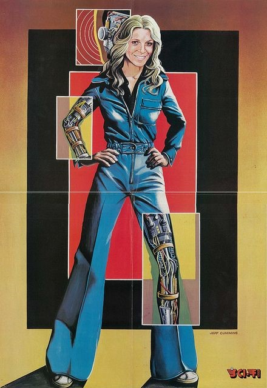
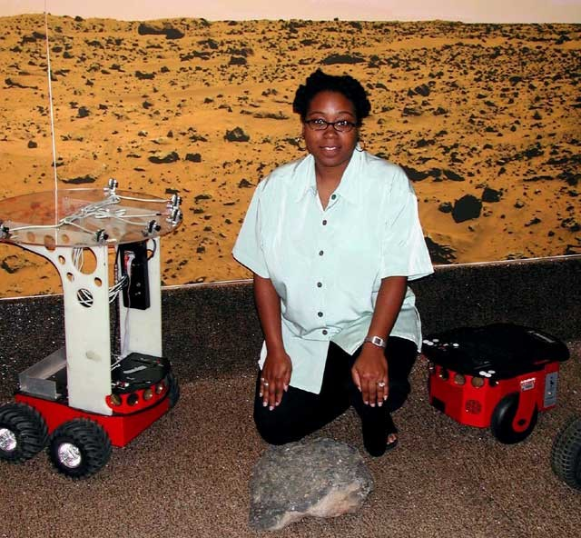

Inspirada pelo programa de televisão The Bionic Woman, Ayanna Howard formou-se em engenharia Elétrica pela Brown University. Obteve seu Ph.D na mesma área pela University of Southern California, e em 2021 tornou-se a primeira mulher a liderar The Ohio State University College of Engineering.

A engenheira e roboticista Ayanna Howard é natural de Altadena, na Califórnia. Filha de Johnetta MacCalla e Eric Conway MacCalla, Howard nasceu em 24 de janeiro de 1972 e foi a primeira dos dois filhos do casal. Ayanna viveu em Altadena durante sua infância com sua família que apesar de não possuir eletrodomésticos modernos, possuía suprimentos e conhecimento necessários para construí-los e consertá-los, dado que seus pais trabalhavam na área de Engenharia Elétrica e programação de computadores.

## Por que engenharia?

Um dos programas preferidos de Ayanna quando criança era o programa de TV, dos anos 70, ‘The Bionic Woman”, no qual uma mulher gravemente ferida obtém poderes extraordinários por meio de membros artificiais. A partir desse programa, surgiu então em Ayanna o desejo de criar membros artificiais para as pessoas o que a fez pensar em fazer faculdade de medicina. Durante o ensino médio sua paixão por matemática foi aflorada, enquanto que a afinidade com biologia não era uma das melhores. Ela então percebeu que ser médica não era algo tão atrativo e que trabalhar com componentes artificiais em vez de membros e partes humanas lhe agradava mais, o que a fez optar por engenharia.

## Formação e Carreira

Ayanna Howard formou-se em Engenharia Elétrica pela Brown University. Seus estudos nas áreas de robótica e inteligência artificial se desenvolveram na University of Southern California, em Los Angeles, onde Ayanna obteve seu Ph.D em Engenharia Elétrica. Sua área de pesquisa consiste basicamente nos conceitos relacionados à inteligência humanizada, à interação humano-robô, à aprendizagem e controle autônomo, o que rendeu a Ayanna inúmeras publicações. Enquanto fazia o seu mestrado e doutorado, Ayanna trabalhava no Jet Propulsion Laboratory (JPL) da NASA onde começou devido a um programa de verão para estudantes e trabalhou até 2005. Nesse mesmo ano ela ingressou na Georgia Tech, onde tornou-se professora associada e fundadora do Laboratório HumAnS, que desenvolve trabalhos na área da inteligência humanizada. Também na Georgia Tech, Howard foi diretora do primeiro programa de doutorado em robótica multidisciplinar do país. Ayanna Howard tem sido exemplo principalmente na tentativa de diversificar a engenharia e torná-la mais próxima das mulheres e também de indivíduos com deficiência. Foi incluída na lista das 50 mulheres em Tecnologia da América pela Forbes e em março de 2021 tornou-se reitora do College of Engineering em The Ohio State University, passando a ser a primeira mulher a liderá-lo.

## O Prêmio Lew Allen de Excelência

De 1993 a 2005 Ayanna trabalhou no Jet Propulsion Laboratory (JPL) da NASA, que é um dos principais centros da unidade no quesito exploração espacial com robôs. Dentre os trabalhos desenvolvidos por ela no JPL, destaca-se o desenvolvimento dos Mars rover, um tipo de veículo automatizado que através da inteligência artificial é capaz de explorar o terreno de Marte por conta própria. Tais robôs poderiam percorrer longas distâncias mesmo em terrenos desafiadores como o marciano sem ter todos os seus movimentos programados por um ser humano. Devido aos trabalhos desenvolvidos por Ayanna, em 2001 ela foi premiada com a maior homenagem possível do JPL, com o Prêmio Lew Allen de Excelência como forma de reconhecer sua significativa liderança e inovação tecnológica.

## O lado empreendedor de Ayanna

Como empreendedora Ayanna se destaca devido à fundação da Zyrobotics, em 2013. A Zyrobotics é uma organização que desenvolve basicamente terapia móvel e outros produtos educacionais para crianças com necessidades especiais, produtos esses que se baseiam nas pesquisas desenvolvidas pela prórpia Ayanna. Uma das grandes contribuições da organização é o desenvolvimento de soluções para o ensino acessível de ciência, tecnologia, engenharia e matemática que seja adaptável à necessidade do aluno.

_**“Não deixe que ninguém te convença a desistir. Saiba que você vai enfrentar a adversidade, mas lide com ela e continue apesar dela.”**_

## Referências

[https://www.ece.gatech.edu/faculty-staff-directory/ayanna-maccalla-howard](https://www.ece.gatech.edu/faculty-staff-directory/ayanna-maccalla-howard) [https://www.nasa.gov/vision/universe/roboticexplorers/ayanna\_howard.html](https://www.nasa.gov/vision/universe/roboticexplorers/ayanna_howard.html) [https://engineering.osu.edu/about/office-dean/about-dean-ayanna-howard](https://engineering.osu.edu/about/office-dean/about-dean-ayanna-howard) [https://spectrum.ieee.org/ayanna-howard-robot-wrangler](https://spectrum.ieee.org/ayanna-howard-robot-wrangler) [https://howard.ece.gatech.edu/](https://howard.ece.gatech.edu/)
